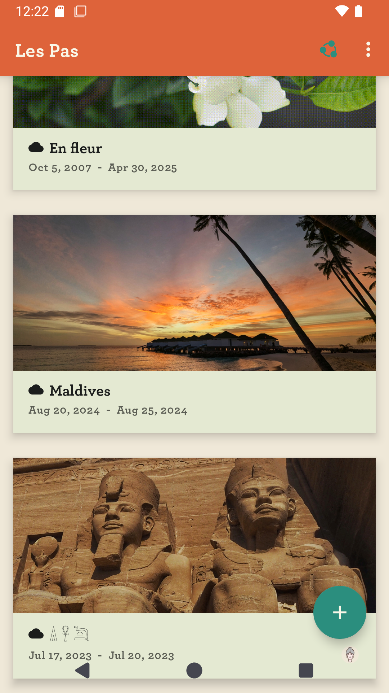

## A private photo album that saves and shares your precious moments
<a href='https://f-droid.org/packages/site.leos.apps.lespas/'></a>
<a href='https://github.com/scubajeff/lespas/releases/'></a>
<a href='https://play.google.com/store/apps/details?id=site.leos.apps.lespas'></a>

Les Pas, is a free, modern, lightweight and fast gallery app. Organize your photos, GIFs and videos into albums for easy viewing and sharing. With built-in two-way sync with your Nextcloud server, your files are kept private, secure and safe.

Although it use Nextcloud as storage backend, you don't have to install any Nextcloud app on server for Les Pas to function. It's a perfect solution if you have limited knowledge or authorization to alter your Nextcloud configuration.

Features:
- ***Managing, Syncing and Archiving***
    * Organize your media files in albums
    * Easy media importing by simply sharing files to Les Pas
    * Manage media files in your phone's gallery and auto backup to server, each media folder in your phone has it's own backup setting
    * Integrate with [Snapseed](https://play.google.com/store/apps/details?id=com.niksoftware.snapseed) for photo editing
    * Support adding caption to photo
    * Synchronization works with Nextcloud server and among multiple devices, edit albums on Nextcloud server and on all your mobile devices simultaneously
    * Support Remote Album, which have all it's media file stored in Nextcloud server only, free up Phone's storage
    * Search for photos by objects with AI
    * Search photos by location
    * Support GPX importing, so that you can easily add GPS location data to pictures shoot on your digital camera
    * Support Nextcloud's external storage
    * Beautiful theme inspired by works of Wes Anderson
    * Support standard media format plus RAW and HDR photos
- ***Sharing***
    * Share albums and album slideshow with other Nextcloud users, groups and circles
    * Unique 'Joint Album' feature, which you and other Nextcloud users can edit together
    * Export GPX file from album, you can share your adventure with others
- ***Privacy focus***
    * Media files and thumbnails are all saved in App's private storage, stop being scanned by malicious apps
    * Option provided to strip photo's EXIF before sharing to other social networks
    * Option to hide album both in Phone and on server
    * Authenticate on your Nextcloud server with your Nextcloud's credential
    * Opensource
- Any apps that can do the above is merely a media file manager with a fancy UI. Les Pas does not stop here, it strives to provide ways of utilizing your photos. ***The past shouldn't be resting in the hard-drive, make all those memories shine***.
    *  Integrate with <a href=https://github.com/muzei/muzei>Muzei Live Wallpaper</a> app, deliver 'Today in History' pictures right on your phone's desktop
    *  Album slideshow, with background music
    *  Unique 'Slideshow on Map' feature which runs album slideshow on Map
    *  Support photo blogging in three ready made templates. With selected pictures and caption you added, you can share your stories with the world. Refer to this [instruction](https://github.com/scubajeff/pico_lespas) for detail.


<p float="left">
  
  
  
  
</p>

<p float="left">
  
  
  
  
</p>

<p float="left">
  
  
  
  
</p>

<p float="left">
  
  
</p>


Here is a short video demonstrate how the slideshow on map works:


https://user-images.githubusercontent.com/458032/176358778-e67fd157-bc3b-4af9-94aa-b18fcd628cc8.mp4


This project is built using the following open source software:
- <a href=https://square.github.io/okhttp>OkHttp</a>
- <a href=https://github.com/chrisbanes/PhotoView>PhotoView</a>
- <a href=https://github.com/osmdroid/osmdroid>osmdroid</a>
- <a href=https://www.tensorflow.org>TensorFlow</a>
- <a href=https://www.openstreetmap.org>OpenStreetMap</a>

<a id="faq"></a>
## Faq
### Why organize by album?
I believe when someone start searching his/her memory for a moment in the past, it's hard for him/her to recall the exact date or exact location, but rather easy to remember what was happening during that period of time, like kid's birthday or family trip to Paris. So organized photos by events is probably the best way for most people, therefore grouping photos by event into an album is the best choice.

### Why use folder but not tag to group photos?
Les Pas uses folders to group photos on the server, e.g., each album in Les Pas app has a one-to-one relationship with a folder on your Nextcloud server. You can manage your photo collection by working with folders/files on server side or albums/photos on your phone, Les Pas will sync changes from both sides. But how about tags? Yes, tagging is much more flexible than folders, and Nextcloud has it's own file tagging support too. But not every picture format supports tagging, that makes tagging picture file a feature which relies heavily on platform specific functions. I would like my data (and yours too) to be platform neutral instead.

### I have a hugh photo collection organized in nested folders, Les Pas only support a flat folder structure.
There is a very cool [scripts](https://gitlab.com/steviehs/digipics) made by [@steviehs](https://github.com/steviehs) to help you out.

### Why does Les Pas use a lot of storage space?
If you set the album as Local Album, Les Pas store photos in it's app private storage, so if you have a large collection of photos, you will find that it use a lot of storage space in Android's setting menu.<br>
There are two reasons why Les Pas use private storage. First, Android introduced scope storage policy recently, highly recommends apps to stay out of share storage area. Second, storing photos in apps private storage area can prevent malicious apps scanning, uploading your photo secretly in the backgroud. Yes, they love your pictures so much, especially those with your face in it.<br>
**For privacy sake, stop using "/Pictures" folder in your phone's internal/external storage.**<br><br>
Since release 2.5.0, Les Pas support managing albums remotely. With Remote Album, all photo's and video's media file are stored in Nextcloud server, this will dramatically reduces app's storage footprint on mobile device.<br>

### It's very slow loading photos from server, the waiting seems forever.
Nextcloud has a reputation of sluggish image processing, to make Remote Album work, you need to setup Nextcloud [Preview Generator](https://apps.nextcloud.com/apps/previewgenerator) app to automatically generate aspect ratio preview files of size 1024x1024. Here is an [excellent document](https://rayagainstthemachine.net/linux%20administration/nextcloud-photos/) on how to do it. You should make sure Les Pas's specific size is taken into action, by:
```
sudo -u www-data php /var/www/html/nextcloud/occ config:app:set --value="256 384 1024" previewgenerator widthSizes
sudo -u www-data php /var/www/html/nextcloud/occ config:app:set --value="256 1024" previewgenerator heightSizes
```

### Why there is no QR code scanning button on Login screen like in the screenshot?
Les Pas supports scanning QR code of server access token generated by Nextcloud server, by using external QR code scanner apps. This app should be compatible with ZXing, which will expose a standard API for Les Pas to call. Make sure your install a compatible scanner app before your start Les Pas for the first time, then you will see the scanning button.

### About synchronization
Les Pas does two types of sync in the background. A two-way sync of your albums and a one-way backup of your phone's camera roll.<br>
Whenever you did something with your albums on your phone, Les Pas will synchronize the changes to your server immediately. Since Nextcloud's push notification only work with Google Firebase Cloud Messaging, which Les Pas decided not to support due to privacy concern, any changes you make to your albums on server side will be synced to your phone during the next synchonization cycle.<br>
Upon opening Les Pas app, it will sync with server once. If you enable periodic sync setting, Les Pas will synchronize with your server every 6 hours in the background.<br>
One-way backup of phone's camera roll is a background job which also happen every 6 hours. So don't delete photos from your camera roll too fast too soon.
If synchronization doesn't seem to work, especially when you phone is a Chinese OEM model, like Huawei, Xiaomi, Oppo etc, please allow Les Pas app to auto start and opt-out battery optimization.

### Checklist for enabling sharing on Nextcloud server
To enable publishing (e.g. sharing album to other users on Nextcloud server), there are several things you need to take care beforehand:
- Make sure your are using LesPas version 2.4.1+ (sroll to the bottom of Setting page to find out)
- Set up groups on Nextcloud server and add users who wish to share LesPas albums to the group. User not belongs to any group can not download sharee list from server, this is a limitation of Nextcloud Sharee API
- Optionally, but highly recommended for the sake of smooth user experience, setup Nextcloud [Preview Generator](https://apps.nextcloud.com/apps/previewgenerator) app to automatically generate aspect ratio preview files of size 1024x1024, LesPas will use those files to populate shared album list on phone.
- Optionally, setup a specific "shared_with_me" folder to house all the shares you received, otherwise Nextcloud will dump all the shares you received onto your root folder. This can be done by adding line `'share_folder' => 'shared_with_me'` into Nextcloud's `config.php` file. Refer to nextcloud [documentation](https://docs.nextcloud.com/server/latest/admin_manual/configuration_server/config_sample_php_parameters.html) for details. If you don't like Nextcloud's dumping behavior at all, a Nextcloud server app [Mv Shared Pics](https://gitlab.com/frederikb96/nextcloud-mvsharedpics), created by [@frederikb96](https://github.com/frederikb96), can be used to automatically move folders a user received via a share, which contain files with a specific mime type (e.g. pictures) to a configurable destination. This is useful in combination with albums shared via Les Pas since they will be automatically moved to the desired location such that the default folder where shares are received is kept clean.